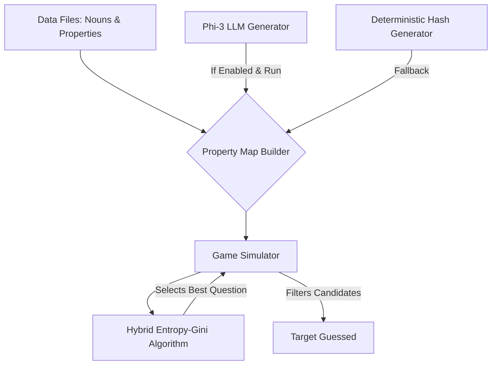

# 20 Questions AI: Information Theory & LLM Property Generation

## Overview
This project is an advanced, automated "20 Questions" game simulator. It leverages Information Theory (a hybrid Entropy and Gini impurity algorithm) to dynamically select the most optimal questions to narrow down a target noun from a vast knowledge base. Additionally, it features an optional AI-driven data pipeline utilizing Microsoft's `Phi-3-mini-4k-instruct` Large Language Model to automatically evaluate and map complex properties to everyday nouns.

## System Architecture

## Technologies Used
* **Python**: Core programming language.
* **Hugging Face `transformers`**: For integrating and running the Large Language Model.
* **Microsoft `Phi-3-mini-4k-instruct`**: The LLM responsible for generating subjective property mappings.
* **Information Theory Algorithms**: Shannon Entropy and Gini Impurity calculations for the decision engine.
* **Pandas**: Used for formatting and displaying benchmark test results.

## The Problem
Building a robust and intelligent "20 Questions" agent presents two major challenges:
1. **Knowledge Base Scalability**: Mapping thousands of nouns to hundreds of subjective or nuanced boolean properties (e.g., "Is it a carnivore?", "Is it easily breakable?") is highly labor-intensive to construct by hand.
2. **Optimal Questioning Strategy**: The system requires a mathematical approach to dynamically select the next best question, maximizing information gain and eliminating the most incorrect candidates per turn, even with unbalanced or sparse data.

## The Solution
To address these challenges, this project implements a two-fold solution:
* **LLM-Powered Data Generation**: Integrates the `Phi-3-mini-4k-instruct` model via Hugging Face `transformers`. The LLM evaluates `(noun, property)` pairs on a 1-10 scale, thresholding the results to automatically generate a comprehensive boolean matrix of features.
* **Hybrid Entropy-Gini Decision Algorithm**: Evaluates the remaining pool of candidates at each step. By calculating a weighted score combining Shannon Entropy (60%) and Gini Impurity (40%), the system reliably identifies and asks the most mathematically discriminative questions, achieving high accuracy in minimal turns (averaging ~10 questions per game).

## Repository Data
The raw datasets required to run this notebook are located in the `data/` directory of this repository:
* `property_universe.txt` - The list of queryable properties.
* `noun_universe.txt` - The list of target nouns.
* `all_per_student.json` - Fallback/historical state data.

## How to Run in Google Colab

To interact with this notebook yourself, follow these steps:

1. **Open in Colab**: Import this `.ipynb` notebook into [Google Colab](https://colab.research.google.com/).
2. **Upload Data Files**: 
   * Download the files from the `data/` directory in this GitHub repository.
   * In Colab, open the file explorer (folder icon on the left sidebar) and upload `property_universe.txt`, `noun_universe.txt`, and `all_per_student.json` directly to the default `/content/` directory.
3. **Hardware Acceleration (Important for LLM Generation)**: 
   * If you wish to use the Phi-3 generator, navigate to `Runtime > Change runtime type` and select **T4 GPU** (or better).
   * In the Configuration cell of the notebook, ensure `USE_PHI3_GENERATOR = True`.
4. **Execute**: Run the notebook sequentially (`Runtime > Run all`).
5. **Interactive Play**: Scroll to the final cells to view the automated benchmark tests, or interact with the manual execution block to play a live game against the algorithm!
